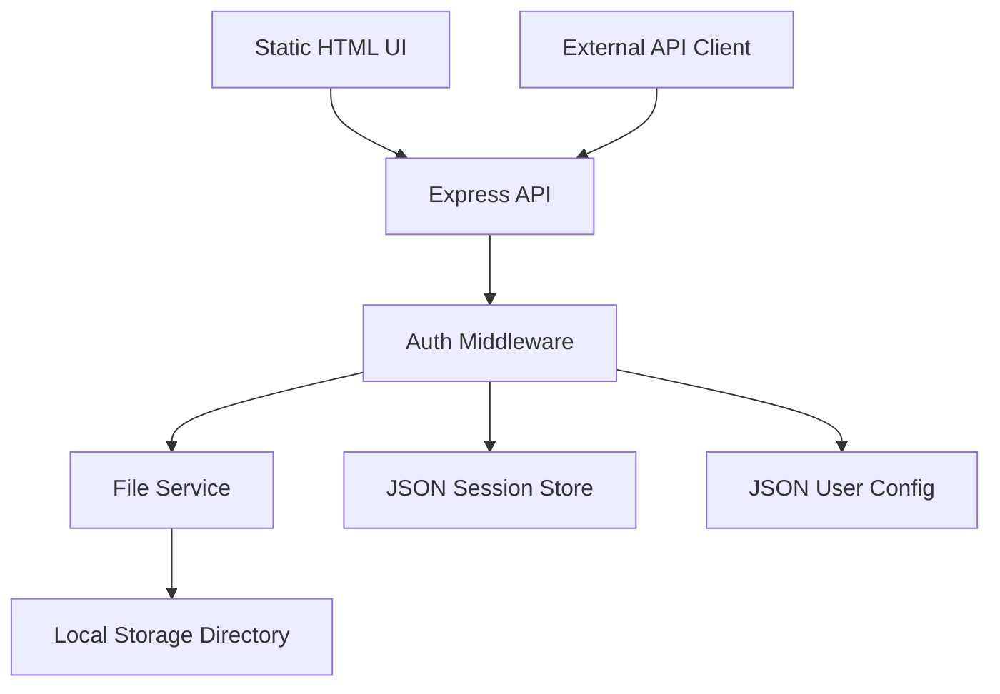

# План архитектуры и реализации SimpleCloud

## 1. Цель продукта

SimpleCloud — максимально легковесный файловый менеджер на Node.js без внешних баз данных. Сервис должен позволять управлять файлами через HTTP API и простой статический веб-интерфейс.

Главный читатель этого документа — разработчик, который должен реализовать MVP без дополнительного архитектурного обсуждения.

После прочтения разработчик должен уметь:

- собрать backend на Express;
- реализовать авторизацию без внешней БД;
- добавить безопасное файловое API;
- сделать быстрый статический frontend с пагинацией;
- запустить и проверить MVP локально.

## 2. Ключевые ограничения

- Backend: Node.js + Express.
- Frontend: статические HTML, CSS и JavaScript.
- Без внешних баз данных: PostgreSQL, MySQL, MongoDB, Redis и аналоги не используются.
- Хранилище файлов: локальная файловая система.
- Метаданные: только файловая система и небольшие JSON-файлы при необходимости.
- UI не должен загружать все файлы сразу: список файлов всегда запрашивается постранично.
- API должно быть пригодно для использования без frontend.
- Реализация должна быть простой, предсказуемой и удобной для поддержки.

## 3. Архитектурный обзор



Система состоит из пяти основных частей:

1. Express-приложение принимает API-запросы и отдает статический frontend.
2. Auth middleware проверяет сессию или API-токен.
3. File service выполняет операции с файлами внутри разрешенной директории.
4. JSON-конфиги хранят пользователей, хэши паролей, настройки и активные сессии.
5. Static UI вызывает API постранично и рендерит только нужный набор элементов.

## 4. Рекомендуемая структура проекта

```text
simplecloud/
  package.json
  PLAN.md
  .env.example
  data/
    .gitkeep
  config/
    users.json
    settings.json
  public/
    index.html
    app.css
    app.js
  src/
    server.js
    app.js
    config.js
    auth/
      authMiddleware.js
      password.js
      sessions.js
    files/
      fileRoutes.js
      fileService.js
      pathSafety.js
    shared/
      errors.js
      asyncRoute.js
```

Назначение директорий:

- `data/` — корневая директория пользовательских файлов.
- `config/` — локальные JSON-файлы с настройками и пользователями.
- `public/` — статический frontend.
- `src/auth/` — авторизация, пароли и сессии.
- `src/files/` — файловое API и защита путей.
- `src/shared/` — общие ошибки и небольшие Express-утилиты.

## 5. Конфигурация

Настройки должны читаться из переменных окружения с безопасными значениями по умолчанию.

Минимальный набор:

| Переменная | Назначение | Значение по умолчанию |
| --- | --- | --- |
| `PORT` | HTTP-порт | `3000` |
| `STORAGE_DIR` | Корень файлового хранилища | `./data` |
| `CONFIG_DIR` | Директория JSON-конфигов | `./config` |
| `SESSION_TTL_HOURS` | Время жизни сессии | `24` |
| `MAX_UPLOAD_MB` | Максимальный размер upload | `100` |
| `NODE_ENV` | Режим запуска | `development` |

Правила конфигурации:

- отсутствующие директории создаются при старте;
- `STORAGE_DIR` должен быть нормализован через `path.resolve`;
- приложение не должно обслуживать файлы вне `STORAGE_DIR`;
- секреты не должны попадать в frontend или логи.

## 6. Авторизация

### 6.1. Модель пользователей

Пользователи хранятся в `users.json`.

Пример структуры:

```json
{
  "users": [
    {
      "id": "admin",
      "username": "admin",
      "passwordHash": "...",
      "role": "admin",
      "createdAt": "2026-06-23T00:00:00.000Z"
    }
  ]
}
```

Требования:

- пароль никогда не хранится в открытом виде;
- для хэширования использовать встроенный `crypto.scrypt` или `crypto.pbkdf2`;
- соль хранится вместе с хэшем в одной строке;
- сравнение пароля выполняется через `crypto.timingSafeEqual`;
- первый пользователь создается через CLI-команду или bootstrap-скрипт, а не через публичный endpoint.

### 6.2. Сессии

Для браузерного UI использовать cookie-сессию.

Рекомендуемая схема:

- после успешного логина сервер создает случайный session id через `crypto.randomBytes`;
- в cookie кладется только session id;
- данные сессии хранятся в JSON-файле или в памяти с периодической записью на диск;
- cookie имеет флаги `HttpOnly`, `SameSite=Lax`, `Secure` в production;
- logout удаляет сессию и очищает cookie.

JSON-хранилище сессий достаточно для MVP. При каждом старте сервера просроченные сессии очищаются.

### 6.3. API-токены

Для внешнего API можно добавить статические токены в конфиге.

Правила:

- API-токен передается через `Authorization: Bearer <token>`;
- токены хранятся только в виде хэшей;
- API-токены не нужны для первого MVP, если достаточно cookie-сессий;
- если API-токены добавляются сразу, они проходят через тот же auth middleware.

## 7. Безопасность файловых операций

Главный риск файлового менеджера — выход за пределы корня хранилища.

Обязательные правила:

- все входные пути считаются недоверенными;
- путь пользователя нормализуется через `path.normalize`;
- абсолютный путь строится только от `STORAGE_DIR`;
- после `path.resolve` проверяется, что результат остается внутри `STORAGE_DIR`;
- запрещены `..`, null byte, пустые имена и системные служебные имена;
- symlink либо запрещается полностью, либо обрабатывается через `fs.realpath` с повторной проверкой корня;
- операции удаления и переименования не должны работать с корнем хранилища;
- ошибки должны возвращать понятные HTTP-статусы без раскрытия внутренних путей сервера.

## 8. HTTP API

Все endpoints, кроме login и статических файлов, требуют авторизации.

### 8.1. Auth API

| Метод | Endpoint | Назначение |
| --- | --- | --- |
| `POST` | `/api/auth/login` | Войти по username/password |
| `POST` | `/api/auth/logout` | Завершить текущую сессию |
| `GET` | `/api/auth/me` | Получить текущего пользователя |

`POST /api/auth/login` принимает:

```json
{
  "username": "admin",
  "password": "password"
}
```

Успешный ответ:

```json
{
  "user": {
    "id": "admin",
    "username": "admin",
    "role": "admin"
  }
}
```

### 8.2. Files API

| Метод | Endpoint | Назначение |
| --- | --- | --- |
| `GET` | `/api/files` | Постраничный список файлов и папок |
| `GET` | `/api/files/download` | Скачать файл |
| `POST` | `/api/files/upload` | Загрузить файл |
| `POST` | `/api/files/folder` | Создать папку |
| `PATCH` | `/api/files/rename` | Переименовать файл или папку |
| `DELETE` | `/api/files` | Удалить файл или папку |
| `POST` | `/api/files/move` | Переместить файл или папку |

### 8.3. Постраничный список

`GET /api/files?path=/docs&page=1&pageSize=50&sort=name&direction=asc`

Параметры:

| Параметр | Назначение | Ограничения |
| --- | --- | --- |
| `path` | Папка для просмотра | по умолчанию `/` |
| `page` | Номер страницы | минимум `1` |
| `pageSize` | Размер страницы | `10`–`200` |
| `sort` | Поле сортировки | `name`, `size`, `modifiedAt`, `type` |
| `direction` | Направление | `asc`, `desc` |

Ответ:

```json
{
  "path": "/docs",
  "page": 1,
  "pageSize": 50,
  "total": 124,
  "items": [
    {
      "name": "report.pdf",
      "path": "/docs/report.pdf",
      "type": "file",
      "size": 2048,
      "modifiedAt": "2026-06-23T00:00:00.000Z"
    }
  ]
}
```

Правила пагинации:

- сервер читает содержимое только текущей папки;
- сервер сортирует элементы до применения `offset` и `limit`;
- frontend не должен запрашивать следующую страницу заранее без действия пользователя;
- `pageSize` ограничивается сервером, даже если клиент передал больше.

### 8.4. Upload

`POST /api/files/upload?path=/docs`

Требования:

- использовать streaming upload через `multer` или нативный stream-подход;
- ограничить размер файла через `MAX_UPLOAD_MB`;
- запретить перезапись файла без явного флага `overwrite=true`;
- имя файла валидировать так же, как путь;
- при ошибке upload удалять частично записанный файл.

Если цель — минимальное число зависимостей, можно начать с `multer`. Это одна зависимость, но она заметно упрощает multipart upload. Если зависимостей нужно избегать почти полностью, upload лучше реализовать вторым этапом через stream и ограничение `Content-Type`/`Content-Length`.

### 8.5. Download

`GET /api/files/download?path=/docs/report.pdf`

Требования:

- endpoint работает только для файлов;
- имя файла в `Content-Disposition` должно быть безопасно экранировано;
- поддержка Range-запросов желательна, но не обязательна для MVP;
- сервер не раскрывает абсолютный путь файла.

### 8.6. Ошибки API

Единая форма ошибки:

```json
{
  "error": {
    "code": "FILE_NOT_FOUND",
    "message": "File not found"
  }
}
```

Базовые коды:

| HTTP | Code | Когда используется |
| --- | --- | --- |
| `400` | `INVALID_REQUEST` | Некорректные параметры |
| `401` | `UNAUTHORIZED` | Нет авторизации |
| `403` | `FORBIDDEN_PATH` | Попытка выйти за пределы storage |
| `404` | `FILE_NOT_FOUND` | Файл или папка не найдены |
| `409` | `ALREADY_EXISTS` | Конфликт имени |
| `413` | `UPLOAD_TOO_LARGE` | Файл слишком большой |
| `500` | `INTERNAL_ERROR` | Непредвиденная ошибка |

## 9. Frontend

Frontend должен быть статическим и быстрым.

Минимальные экраны:

1. Login screen.
2. File browser.
3. Upload progress.
4. Простые модальные действия: создать папку, переименовать, удалить.

### 9.1. Принципы UI

- один `index.html`, один `app.css`, один `app.js`;
- без SPA-фреймворков для MVP;
- все API-запросы через `fetch`;
- состояние хранится в простом объекте: текущий путь, страница, размер страницы, сортировка;
- список файлов рендерится только для текущей страницы;
- кнопки пагинации используют данные `total`, `page`, `pageSize`;
- загрузка следующей страницы выполняется только по клику пользователя;
- для больших папок не строить DOM из тысяч элементов;
- показывать loading state и понятные ошибки.

### 9.2. Компоненты интерфейса

- Header: название, текущий пользователь, logout.
- Breadcrumbs: переход по частям текущего пути.
- Toolbar: upload, create folder, refresh.
- File table: name, type, size, modified date, actions.
- Pagination: previous, next, current page, total pages.
- Empty state: папка пуста.
- Error banner: ошибка API или сети.

### 9.3. Поведение списка

- папки показываются перед файлами при сортировке по имени;
- клик по папке открывает ее и сбрасывает страницу на `1`;
- клик по файлу скачивает его или открывает меню действий;
- после upload, rename, move или delete текущая страница обновляется;
- если после удаления страница стала пустой, UI переходит на предыдущую страницу.

## 10. Работа без внешней базы данных

Для MVP используются три типа данных:

1. Файлы пользователя — физически лежат в `STORAGE_DIR`.
2. Пользователи — лежат в `users.json`.
3. Сессии — лежат в `sessions.json` или памяти с записью на диск.

Правила записи JSON-файлов:

- запись выполняется атомарно: сначала временный файл, затем rename;
- перед записью данные сериализуются с отступами для читаемости;
- поврежденный JSON при старте должен давать понятную ошибку и останавливать сервер;
- не хранить часто меняющиеся данные в больших JSON-файлах.

Важное ограничение: JSON-файлы подходят для одного процесса Node.js. Горизонтальное масштабирование и несколько инстансов потребуют отдельного session storage или sticky sessions.

## 11. Зависимости

Минимальный рекомендуемый набор:

```json
{
  "dependencies": {
    "express": "latest",
    "cookie-parser": "latest",
    "multer": "latest"
  },
  "devDependencies": {
    "nodemon": "latest"
  }
}
```

Можно обойтись без `cookie-parser`, если парсить cookie вручную, но это ухудшит читаемость. `multer` можно отложить, если upload не входит в первый вертикальный срез.

## 12. План реализации

### Этап 1. Базовый сервер

Цель: поднять Express и отдать статический frontend.

Задачи:

- создать `src/server.js` и `src/app.js`;
- добавить чтение конфигурации;
- создавать `STORAGE_DIR` и `CONFIG_DIR` при старте;
- подключить `express.json`;
- раздавать `public/`;
- добавить health endpoint `GET /api/health`.

Критерий готовности:

- сервер запускается командой `npm start`;
- `GET /api/health` возвращает `{ "status": "ok" }`.

### Этап 2. Безопасная работа с путями

Цель: исключить path traversal до добавления файловых операций.

Задачи:

- реализовать `resolveStoragePath(userPath)`;
- добавить проверку выхода за пределы `STORAGE_DIR`;
- запретить опасные имена;
- покрыть функцию unit-тестами.

Критерий готовности:

- `../`, абсолютные пути и попытки выйти из storage отклоняются;
- обычные пути внутри storage проходят.

### Этап 3. Авторизация

Цель: закрыть API сессиями.

Задачи:

- реализовать хэширование пароля;
- добавить чтение `users.json`;
- добавить bootstrap-команду создания admin-пользователя;
- реализовать login/logout/me;
- добавить auth middleware;
- защитить все `/api/files/*` endpoints.

Критерий готовности:

- неавторизованный клиент получает `401`;
- авторизованный браузер получает доступ к API;
- пароль не хранится в открытом виде.

### Этап 4. Список файлов с пагинацией

Цель: реализовать основную навигацию по storage.

Задачи:

- добавить `GET /api/files`;
- читать только содержимое текущей папки;
- возвращать `total`, `page`, `pageSize`, `items`;
- добавить сортировку;
- ограничить `pageSize`;
- обработать пустые папки и несуществующие пути.

Критерий готовности:

- папка с большим количеством файлов не отправляется клиенту целиком;
- frontend получает только текущую страницу.

### Этап 5. Статический frontend

Цель: сделать быстрый UI поверх API.

Задачи:

- сверстать login screen;
- реализовать login/logout через fetch;
- сверстать таблицу файлов;
- добавить breadcrumbs;
- добавить пагинацию;
- добавить loading и error состояния;
- не рендерить элементы за пределами текущей страницы.

Критерий готовности:

- пользователь может войти, открыть папку, перейти по страницам и выйти.

### Этап 6. Download и базовые операции

Цель: добавить управление файлами без upload.

Задачи:

- реализовать download;
- реализовать создание папки;
- реализовать rename;
- реализовать delete;
- реализовать move, если нужен MVP с перемещением;
- обновить UI-действия.

Критерий готовности:

- пользователь может скачать файл, создать папку, переименовать и удалить объект.

### Этап 7. Upload

Цель: добавить загрузку файлов с ограничением размера.

Задачи:

- подключить upload middleware;
- ограничить размер файла;
- валидировать целевой путь и имя;
- добавить progress в UI;
- обработать конфликты имен;
- удалить частично загруженный файл при ошибке.

Критерий готовности:

- пользователь может загрузить файл в текущую папку;
- слишком большой файл отклоняется корректной ошибкой.

### Этап 8. Тестирование и стабилизация

Цель: проверить критичные сценарии перед использованием.

Задачи:

- unit-тесты для path safety;
- unit-тесты для password hashing;
- integration-тесты для auth endpoints;
- integration-тесты для list files;
- ручная проверка UI на папке с сотнями файлов;
- проверка ошибок: нет доступа, нет файла, конфликт имени, большой upload.

Критерий готовности:

- основные команды проходят локально;
- критичные ошибки возвращают предсказуемый JSON.

## 13. Минимальный MVP

Если нужно выпустить максимально быстро, MVP должен включать только:

1. Express server.
2. Cookie-based login/logout.
3. Безопасный list files с пагинацией.
4. Download.
5. Static UI для login, navigation, pagination и download.

Создание папок, rename, delete, move и upload можно добавить следующими вертикальными срезами.

## 14. Нефункциональные требования

Производительность:

- не читать содержимое вложенных папок при листинге;
- не отправлять клиенту полный список большой директории;
- ограничивать `pageSize`;
- использовать streaming для download и upload;
- не хранить бинарные файлы в памяти целиком.

Безопасность:

- все файловые endpoints требуют авторизации;
- path traversal запрещен на уровне service-функций;
- cookie защищены безопасными флагами;
- ошибки не раскрывают абсолютные пути;
- upload имеет лимиты размера;
- destructive operations требуют явного endpoint и метода.

Поддерживаемость:

- бизнес-логика файлов вынесена из Express routes;
- auth middleware не знает деталей файлового сервиса;
- ошибки имеют единый формат;
- конфигурация централизована;
- функции небольшие и тестируемые.

## 15. Риски и решения

| Риск | Решение |
| --- | --- |
| Path traversal | `resolveStoragePath` + проверка `path.resolve`/`fs.realpath` |
| Большие директории | Пагинация и лимит `pageSize` |
| Большие файлы | Streaming и лимит upload |
| Повреждение JSON-конфига | Атомарная запись и fail-fast при старте |
| Несколько Node.js процессов | Для MVP не поддерживать, явно задокументировать ограничение |
| Symlink escape | Запретить symlink в MVP или проверять realpath |
| Удаление корня storage | Явно запретить операции над `/` |
| Утечка абсолютных путей | Логировать внутри, клиенту отдавать нейтральные сообщения |

## 16. Рекомендуемый порядок API-first разработки

1. Реализовать backend health check.
2. Реализовать path safety и тесты.
3. Реализовать auth API.
4. Реализовать `GET /api/files`.
5. Проверить API через curl или HTTP-клиент.
6. Реализовать frontend поверх готового API.
7. Добавить download.
8. Добавлять изменяющие операции по одной.
9. В конце добавить upload.

Такой порядок снижает риск: сначала закрываются безопасность путей и авторизация, затем появляется UI.

## 17. Примеры ручной проверки

Проверка health:

```sh
curl http://localhost:3000/api/health
```

Проверка запрета без авторизации:

```sh
curl -i http://localhost:3000/api/files
```

Проверка логина:

```sh
curl -i -X POST http://localhost:3000/api/auth/login \
  -H 'Content-Type: application/json' \
  -d '{"username":"admin","password":"password"}'
```

Проверка пагинации:

```sh
curl -i 'http://localhost:3000/api/files?path=/&page=1&pageSize=50'
```

## 18. Definition of Done

Реализация считается готовой для MVP, когда:

- сервер стартует одной командой;
- есть bootstrap admin-пользователя;
- API закрыто авторизацией;
- path traversal покрыт тестами;
- список файлов работает постранично;
- frontend не загружает лишние страницы;
- download работает через stream;
- ошибки API имеют единый JSON-формат;
- README или инструкция запуска описывает создание пользователя и старт сервера.
